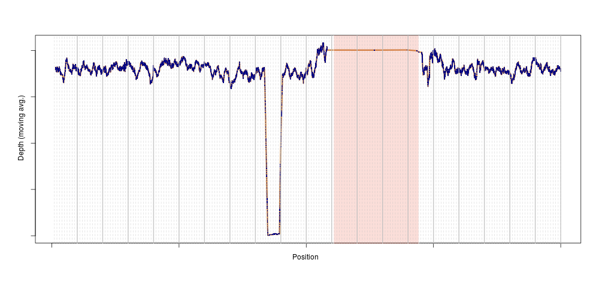
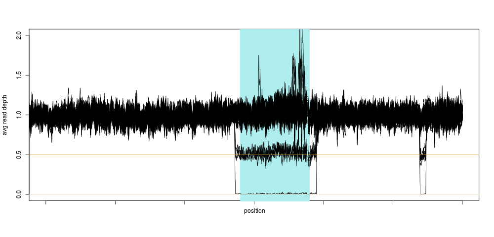
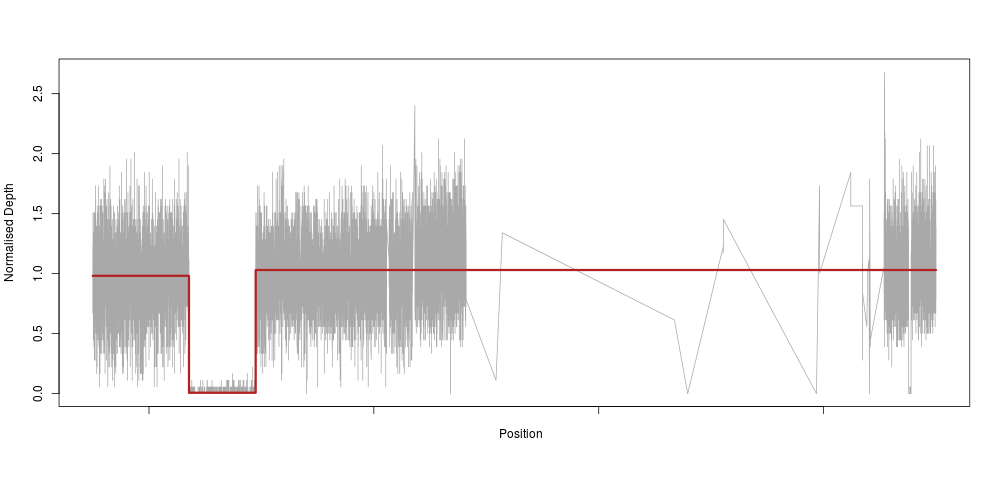
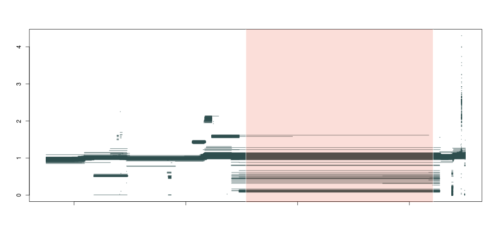
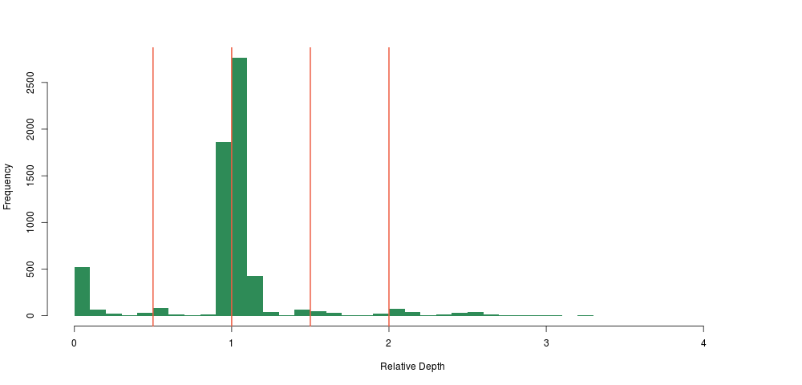
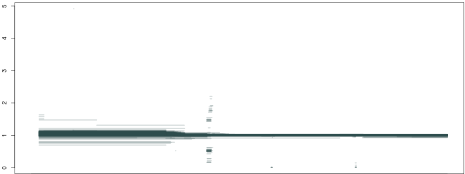
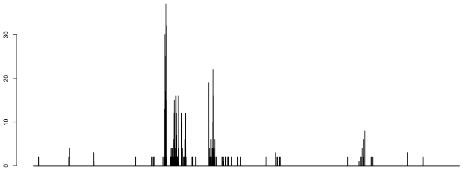

# Discovering copy number variants based on VCF files

## Introduction
Copy number variants (CNV) are genetic events in which a portion of the genome gets duplicated or deleted. These events can be relatively innocuous, or have dramatic medical consequences. These events vary greatly in size, from a few kilo-base pairs to entire chromosomes (trisomy 21 is technically a CNV, more specifically a duplication of the whole of chromosome 21). 

Most CNV identification tactics are based on whole-genome sequencing, specifically using aligned reads. Moreover, there is no standard file format or generally accepted tool for calling and describing CNVs, despite VCF's recent efforts to provide a generic file format for storing them. But this state of things means that CNV detection is tricky and resource-intensive, and is mostly restricted to specialised groups who focus on this type of mutation and nothing else. But by and large, a CNV is just another variation, and statistical genetics groups have studied smaller, more traditional variants for ages. In that field, the VCF format is standard, however it only contains information about _genetic variation_, whereas usual CNV callers need information about the _entire genome_ to call a duplication or deletion event.

So, our question is: can we call copy number variants from single-nucleotide call sets coming from reasonably-covered whole-genome sequencing projects? As it turns out, we can.

## It's all about depth
This was a serendipitous discovery. As I was performing quality control for a larger project with Daniel Suveges, we wanted to exclude depth outliers, i.e. samples with not enough, (or too much, but that never happens) sequencing depth. We were doing our measures on chromosome 11 to save time, and were just extracting depth of coverage at every variant using the `INFO/DP` tag. Based on this, we excluded one individual.

Later, just for peace of mind, I repeated the analysis genome-wide. The outlier disappeared, suggesting that the depth anomaly for that sample was somehow localised to chromosome 11.  We plotted the depth for that individual on chromosome 11, and bingo:



This is exactly what a homozygous deletion could look like: for a stretch of DNA several 100s of kilobase-pairs long, sequencing depth is zero for one sample. That drop in sequencing depth was strong enough to make the sample an outlier for depth on this entire chromosome (the shaded region is the centromere, where no variants are present). Of course, as soon as we knew there could be something in that region, we looked across the entire population, and again, a clear pattern emerged:



Not only did we see a clear concentration around 0.5 and 0 relative depth for that particular region, we saw that there was likely another deletion event close-by, too small to have a large impact on the depth, so too small for us to notice using the method above. This was also very encouraging, because we were likely not seeing sequencing artifacts, as hard-to sequence regions have no reason to be exactly half as hard to sequence (yielding 0.5 relative depth), and so the method was born.

I guess our main surprise was that the signal was so clean. Looking at the depth distribution around that region was almost too good to be true, with very clear boundaries around $$0.5 \plusminus 0.05$$ relative depth.

## Automating detection of boundaries with a regression tree

So, as an applied mathematician (if there is such a thing), I immediately thought "we need to fit a piecewise constant function to this". Which means, basically, that we would fit a very constrained model that only allows for our depth to be constant along a certain stretch of DNA, then drop to 0 (or 0.5 for heterozygotes), then back to a constant 1 again. In machine learning lingo, this method is called a regression tree. So, we use the very nifty and easy to use `rpart` R method to fit such a tree to the raw depth measures for our homozygous sample:



The model reacts perfectly (note the very sparse centromeric region again) with a clear drop to zero in the region of our deletion. This is essentially an extreme downsampling of the frequency of our depth signal.

So, what happens if we do this not just for 1 individual, but across a population of about ~1300 samples, and plot all piecewise constant fragments together? A thing of beauty:



Here we see that not only are our deletion boundaries clearly delineated, there are much more complex events happening within it (small duplications or repeats), including duplications (clusters around 1.5 and 2 between our deletion and the centromere) and hard-to-map regions (the vertical bar towards the right end of the plot) probably composed of repeats. We have effectively transformed the depth signal from our VCF single-nucleotide calls into an exhaustive description of depth anomalies genome-wide. And extracting the relevant info was extremely simple. As in:

```bash
bcftools query -f '%CHROM\t%POS\t[%DP\t]\n' file.vcf.gz
```

Looking at the distribution of our constant fragments, we again notice clear peaks around the expected heterozygous and homozygous deletion and duplications:



## A first, crude deletion caller

Clearly, to call boundaries we need to aggregate these breakpoints, and add our prior knowledge about where "real" breaks will occur. For deletions, as we have said, we expect $$\left{ 0,0.5,1 \right}$$. 

If we discretize the x axis and plot the number of breakpoints occurring per bin, we get something like:





Two things to note here:

* just counting breakpoints is unsatisfactory, as most breaks occur around 1. The next strongest signal is around the hard-to-map region right of the centromere, which is logical given the large depth heterogenity in that region. The signal that we want to see (the two dots around 0 to the right) is very weak on the histogram of breaks.
* the first parameter of the algorithm is emerging: namely the discretisation of the x axis. This parameter does not have a huge influence, apart from the fact that CNVs smaller than the discretisation window are at risk of being incorrectly called.

To address the first point, we only count breakpoints occurring around narrow bands around 0.5 and 0


